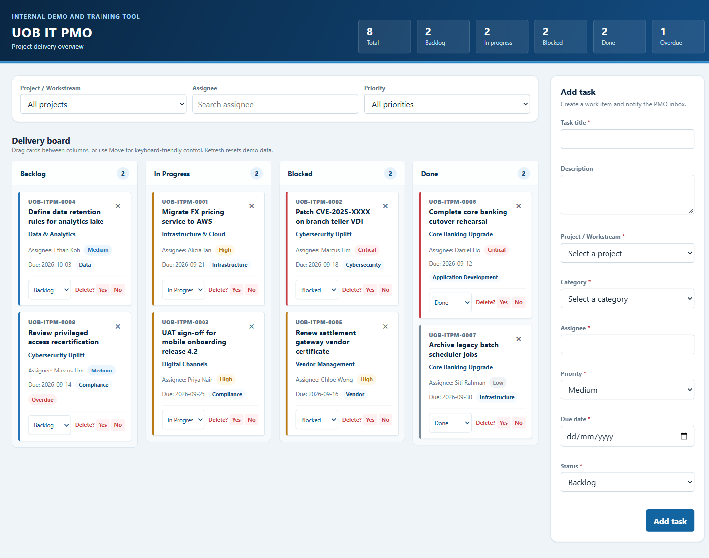

# kanban3

A single-file, dependency-free Kanban board for tracking IT project work (UOB IT PMO demo/training tool). Drag-and-drop task cards across Backlog, In Progress, Blocked, and Done columns, filter by project/assignee/priority, and add new tasks through a validated form. Board state is in-memory only — refreshing the page resets it to the seeded demo data by design.

## Live demo

https://boxxes.github.io/kanban3/



## Running locally

No install or build step — just open `index.html` directly in a browser:

```
start index.html
```

## Stack

Vanilla HTML/CSS/JS only, no frameworks, no build tooling, no external resources. See [CLAUDE.md](CLAUDE.md) for architecture notes.
